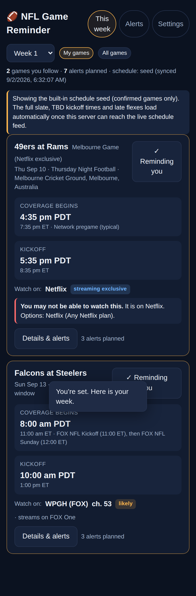
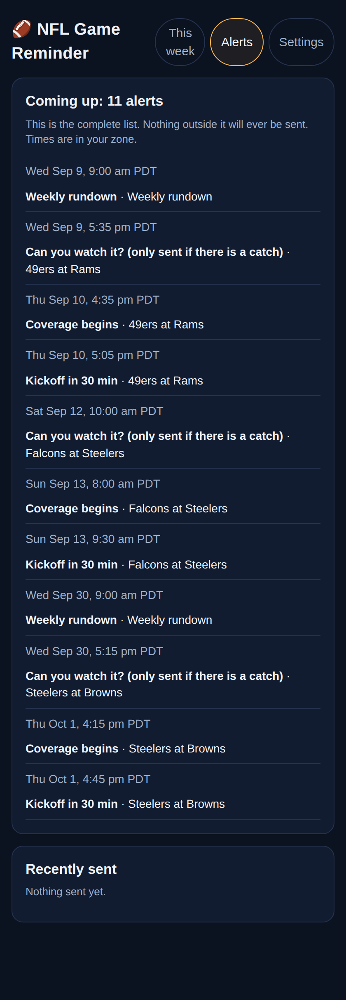

# NFL Game Reminder

Alerts for the NFL games you follow that tell you **when coverage begins, when kickoff is
(in your time zone, with ET alongside), which network or streaming service has the game, and
what channel that is in your market on your provider.** No ads, no account, no news feed.

It was built from a review study of the top sports apps and sites. The research is in `docs/`:

| Prompt | Document |
|---|---|
| 1. Gather reviews | [docs/01-review-corpus.md](docs/01-review-corpus.md) |
| 2. Recurring complaints | [docs/02-complaint-analysis.md](docs/02-complaint-analysis.md) |
| 3. Pain gaps nobody solves | [docs/03-pain-gaps.md](docs/03-pain-gaps.md) |
| 4. How this app answers them | [docs/04-product-decisions.md](docs/04-product-decisions.md) |
| iOS build plan by tier | [docs/05-ios-tiers.md](docs/05-ios-tiers.md) |

## What it does

- **Two clocks on every game and every alert:** "Coverage begins 10:00 am PDT (FOX NFL Sunday)
  · Kickoff 1:00 pm PDT (4:00 pm ET)". Pregame rules per network are modeled, not guessed.
- **Your channel, in your market:** ZIP → TV market → local CBS/FOX/NBC/ABC station → channel
  number on your provider (exact for antenna, DirecTV, DISH; user-set once for cable; call-sign
  search hints for YouTube TV, Hulu, Fubo, Sling). ESPN/NFL Network numbers per provider.
- **Regional-game resolution:** for Sunday CBS/FOX windows, which game *your* station shows,
  with a confidence label (confirmed / likely / unknown) and an "instead they show…" note.
- **Access check a day ahead:** if a followed game is Netflix/Prime/Peacock/ESPN+-only and you
  do not pay for it, you get one warning with options. Sunday Ticket local-blackout and NFL+
  mobile-only caveats are called out.
- **Flex-aware:** the schedule is re-synced every 15 minutes, diffed, and a moved game triggers
  one "schedule change" alert with old → new time/network/channel. Reminders re-arm themselves.
- **Consent-scoped alerts:** per-moment opt-in (coverage start, kickoff lead times, kickoff,
  access, weekly rundown, change), quiet hours, a daily cap, and an **Alerts tab that lists
  every alert that will fire.** Nothing outside that list is ever sent.
- **Delivery:** Web Push (PWA, works on iPhone from the Home Screen), a webhook (ntfy.sh for
  free phone alerts, Slack/Discord, Zapier, Home Assistant), optional Twilio SMS, and a
  subscribable **.ics calendar feed** that updates when games move.

## Run it

```bash
npm install
npm run vapid          # prints VAPID keys; put them in .env (copy .env.example)
npm start              # http://localhost:3000
```

- `SCHEDULE_SOURCE=espn` (default) pulls the live schedule from ESPN's public scoreboard JSON
  every `SYNC_INTERVAL_MIN` minutes and keeps a cached copy in `data/db.json`. If that endpoint
  is unreachable the app runs on the bundled seed (`server/schedule/seed-2026.json`), which
  holds the confirmed 2026 games as of early September 2026 and is clearly labeled in the UI.
- `SCHEDULE_SOURCE=seed` runs fully offline.
- `npm run sync` does a one-off sync from the CLI.
- Push needs HTTPS in production (localhost is exempt). Put the app behind any TLS proxy.

### Try the flex flow locally

```bash
# with the server running and a user created in the UI:
curl -X POST localhost:3000/api/admin/simulate-change -H 'content-type: application/json' \
  -d '{"gameId":"2026-W01-ATL-PIT","kickoff":"2026-09-14T00:20:00Z","networks":["NBC"],"streams":["Peacock"],"window":"SNF"}'
```

Everyone following that game gets a "Schedule change" alert naming the new station and channel,
and the Alerts tab shows the re-armed reminders. (The endpoint is disabled when
`NODE_ENV=production` unless `ALLOW_SIMULATE=1`.)

## Test

```bash
npm test
```

Covers the coverage engine, channel resolution, access checks, ESPN normalization, schedule
diffing and fallback, the scheduler (dedupe, re-arm after a flex, quiet hours, daily cap, late
skips), the ICS feed, and the HTTP API.

## iOS app

A native SwiftUI port lives in [`ios/`](ios/README.md) (XcodeGen project, engine port, local
notifications, background refresh, EventKit, widget, XCTests). See `docs/05-ios-tiers.md` for the
tiered plan to App Store release.

## Layout

```
server/
  index.js                 Express app, API routes, boot (sync loop + alert ticker)
  cards.js                 game + user -> fully resolved card with confidences
  ics.js                   calendar feed
  db.js                    JSON file store (users, sent-log, schedule cache, change log)
  schedule/                teams, broadcast-window rules, seed, ESPN adapter, sync + diff
  market/                  markets (DMAs), affiliates, ZIP prefixes, providers, services
  coverage/                regional "which game airs here" engine + editorial overrides
  notify/                  alert planner/ticker, templates, push/webhook/SMS channels
  util/time.js             time-zone formatting, quiet hours
public/                    PWA (vanilla JS), service worker, manifest
test/                      node:test suites
docs/                      research and product decisions
```

## Data honesty

Every derived fact carries a confidence and the UI shows it. Defaults are labeled as defaults,
regional assignments as confirmed/likely/unknown, and unverified seed rows as unconfirmed. The
user can correct their channel numbers once and every alert uses theirs. Editorial coverage
maps (e.g. 506 Sports, posted Wednesdays) go in `server/coverage/overrides-2026.json`.

## Privacy

No email, password, or tracking. A user is a random token stored in the browser. Push
subscriptions, webhook URLs and phone numbers stay on your server. "Delete my data" removes it.

## Screenshots

| This week | Alerts (complete list of what will fire) |
|---|---|
|  |  |
